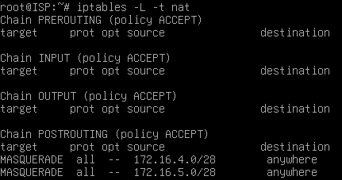

## Статус проекта

[](ссылка_на_статус)

## Содержание

- [Базовая_Настройка](#Базовая_Настройка)
- [ISP](#ISP)
- [HQ-RTR](#HQ-RTR)
- [HQ-SRV](#HQ-SRV)
- [BR-RTR](#BR-RTR)
- [BR-SRV](#BR-SRV)
- [CLI](#CLI)
- [Доп_инф](#Доп_инф)

## Базовая_Настройка
<b>Настройка имени</b>  
Для начало нужно поменять именна на машинах<br>`hostnamectl set-hostname [ИмяУстройства]`  

    
<b>Настройка портов</b>  
Далее нам нужно настроить порты на каждом устройстве пример настройки  
```
auto ens224  
iface ens224 inet static  
address 172.16.4.1  
netmask 255.255.255.240
```  
Ещё есть строка `gateway айпи` Пишем там где нужен gateway  
  
Дополнение:
  
1. ens*** - порт  
2. Айпишники и маски смотрим по заданию
  
<b>⚠!!!ВНИМАНИЕ!!!⚠</b>  
Если в задании не будут использоваться встроенные репозитории, а будет  
возможность скачивать все пакеты из интернета, необходимо отключить  
проверку пакетов через cdrom зайдя по пути:  
`Nano /etc/apt/sources.list`  

На HQ-RTR и BR-RTR Нужно зайти в файл `/etc/resolv.conf` и оставить там только одну строку: `nameserver 1.1.1.1`

Везде нужно зайти в файл `/etc/sysctl.conf` и раскомментировать строку `net.ipv4.ip_forward=1` после прописать `sysctl -p`  
Теперь после каждого reboot машины нужно прописывать `sysctl -p`  

## ISP   
  
Выполнить базовою настройку после идти ниже  
  
Важно если не качаются пакеты или не работает ping на 8.8.8.8 Передите в  
базовую настройку и прочитайте пункт !!!ВНИМАНИЕ!!!  
  
<b>iptables</b>  
```
apt install iptables  
apt install iptables iptables-persistent  
iptables –t nat –A POSTROUTING –s 172.16.4.0/28 –o ens192 –j MASQUERADE  
iptables –t nat –A POSTROUTING –s 172.16.5.0/28 –o ens192 –j MASQUERADE  
iptables-save > /etc/iptables/rules.v4  
```
  
Айпишник это подсеть куда идёт nat, ens192 это порт с интернетом  

Далее проверяем вышло ли настроить:  
`iptables –L –t nat` 
<details>
<summary>✔️ Результат проверки</summary>



</details>  

## HQ-RTR  
  
Выполнить базовою настройку после идти ниже  
Важно если не качаются пакеты или не работает ping на 8.8.8.8 Передите в  
базовую настройку и прочитайте пункт !!!ВНИМАНИЕ!!!  
  
<b>vlan</b>  
```
apt install vlan
modprobe 8021q
echo 8021q >> /etc/modules  
```
Теперь переходим в настройку интерфейсов пример указан ниже:  
```
auto ens192  
iface ens192 inet static  
address 172.16.4.2  
netmask 255.255.255.240  
gateway 172.16.4.1  
  
auto ens224  
iface ens224 inet static  
address 192.168.100.1  
netmask 255.255.255.192  
  
auto ens224:1  
iface ens224:1 inet static  
address 192.168.200.1  
netmask 255.255.255.240  

auto ens224.100  
iface ens224.100 inet static  
address 192.168.100.3  
netmask 255.255.255.192  
Vlan-raw-device ens224  
  
auto ens224.200  
iface ens224.200 inet static  
address 192.168.200.3  
netmask 255.255.255.240  
Vlan-raw-device ens224:1
```
  
<b>iptables</b>  
`iptables –t nat –A POSTROUTING –s 192.168.100.0/26 –o ens192 –j MASQUERADE`  
  
<b>Создание пользователей</b>  
Создание 
`adduser Имя пользователя`  
  
Для смены id используется команда `usermode -u 1010 пользователь`  
  
Так же возможно понадобится выдать Root права для данных клиентов это можно выполнить 
посредством команды `visudo`  
  
  
<b>Реализация GRE-туннеля между офисами</b>  
  
Нужно зайти в файл `/etc/modules` и добавить там строку `ip_gre`  
Вся последующая настройка проводится в файле `/etc/network/interfaces`    
```
auto tun1  
iface tun1 inet tunnel  
address 10.10.0.1  
netmask 255.255.255.252  
mode gre  
local 172.16.4.2  
endpoint 172.16.5.2  
ttl 64
```  
  
## HQ-SRV  
  
Важно если не качаются пакеты или не работает ping на 8.8.8.8 Передите в  
базовую настройку и прочитайте пункт !!!ВНИМАНИЕ!!!  
  
<b>Создание пользователей</b>  
Создание 
`adduser Имя пользователя`  
  
Для смены id используется команда `usermode -u 1010 пользователь`  
  
Так же возможно понадобится выдать Root права для данных клиентов это можно выполнить 
посредством команды `visudo`  
  
  
<b>Настройка безопасного удалённого доступа</b>  
  
Первым делом необходимо перейти по пути nano `/etc/ssh/sshd_config` после меняем там параметры:  
**Port** - такой какой нам нужен  
**AllowUsers** - Пользователь кому можно подключаться  
**MaxAuthTries 2** – ограничение попыток  
**Banner /etc/ssh-banner** – Наш баннер  
  
Теперь нам нужно созать наш банер по пути который мы указали выше
## BR-RTR  
Важно если не качаются пакеты или не работает ping на 8.8.8.8 Передите в  
базовую настройку и прочитайте пункт !!!ВНИМАНИЕ!!!  
<b>Создание пользователей</b>  
Создание 
`adduser Имя пользователя`  
  
Для смены id используется команда `usermode -u 1010 пользователь`  
  
Так же возможно понадобится выдать Root права для данных клиентов это можно выполнить 
посредством команды `visudo`  
  

## BR-SRV  
  
Важно если не качаются пакеты или не работает ping на 8.8.8.8 Передите в  
базовую настройку и прочитайте пункт !!!ВНИМАНИЕ!!!  
  
<b>Создание пользователей</b>  
Создание 
`adduser Имя пользователя`  
  
Для смены id используется команда `usermode -u 1010 пользователь`  
  
Так же возможно понадобится выдать Root права для данных клиентов это можно выполнить 
посредством команды `visudo`  
  
  
<b>Настройка безопасного удалённого доступа</b>  
  
Первым делом необходимо перейти по пути nano `/etc/ssh/sshd_config` после меняем там параметры:  
**Port** - такой какой нам нужен  
**AllowUsers** - Пользователь кому можно подключаться  
**MaxAuthTries 2** – ограничение попыток  
**Banner /etc/ssh-banner** – Наш баннер  
  
Теперь нам нужно созать наш банер по пути который мы указали выше  

<b>Реализация GRE-туннеля между офисами</b>  
  
Нужно зайти в файл `/etc/modules` и добавить там строку `ip_gre`  
Вся последующая настройка проводится в файле `/etc/network/interfaces`    
```
auto tun1  
iface tun1 inet tunnel  
address 10.10.0.2  
netmask 255.255.255.252  
mode gre  
local 172.16.5.2  
endpoint 172.16.4.2  
ttl 64
```
  
## CLI  
  
Важно если не качаются пакеты или не работает ping на 8.8.8.8 Передите в  
базовую настройку и прочитайте пункт !!!ВНИМАНИЕ!!!  
  
## Доп_инф  
<details>
<summary>🎭 Таблица Масок</summary>


</details>  
  
<details>
<summary>✍🏻 Как узнать куда какой IP</summary>

2

</details>  

